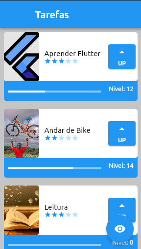
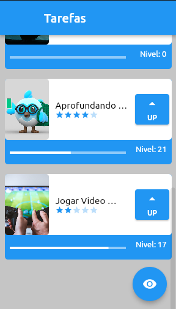

# Listinha de Tarefas 📝❤️

### Olá! Bem vindo! ❤️

Esse projetinho foi desenvolvido durante o início da minha trajetória na Formação: Desenvolva seu primeiro app com Flutter, na Alura. Muitos desafios e uma chuva de aprendizados, destacando: **Widgets, Stateless, Stateful, Imagens e Animações**.

Segue, a seguir, com visualizações do app que foi desenvolvido:

  
  

